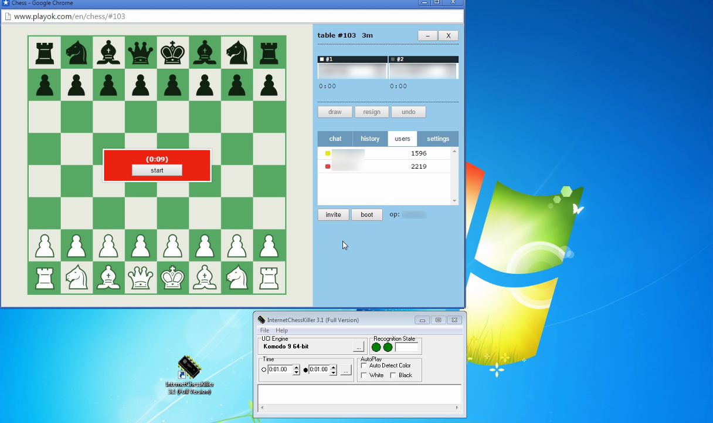
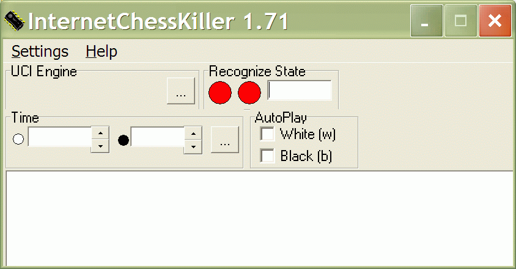
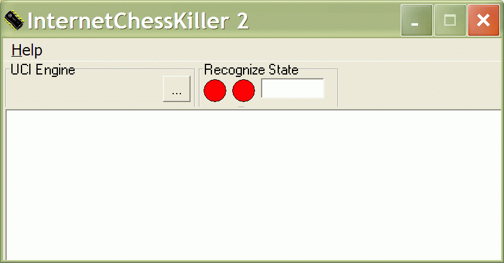
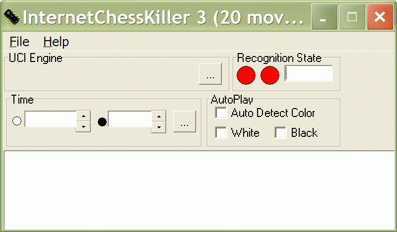
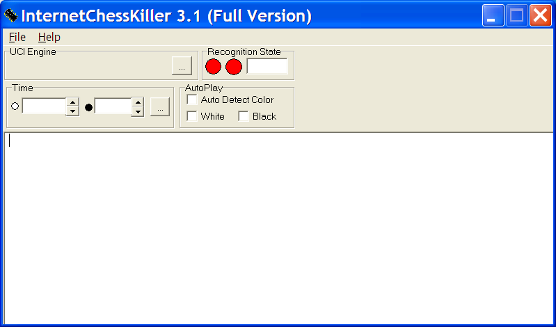

InternetChessKiller

Program created for automatic use computer chess program
help for playing on chess servers

Short description:
program periodically capture screen,
if chess board has been found with start position,
when chess program has been started
if board has been changed,
when analyze has been changed accordingly

Program works on many chess board game websites:

www.playchess.com

www.chessplanet.ru

www.bereg.ru

www.instantchess.com

www.kurnik.org

www.kurnik.pl

www.playok.com

www.chessgate.de

www.spinchat.de

www.superchat.at

www.aby.spinchat.de

www.chessclub.com dasher (Classic Sets - Book)

winboard

and many more.

Author: Dmitry Morozov
Contacts: email: dm-chess@yandex.ru

That is the source code of v 1.71. 
That is the only source code available.
Version above 2, 3, 3.1 DEMO, 3.1 FULL CRACKED 
are only the exe binaries.

You may watch the videos:

http://www.cda.pl/video/2256328f?wersja=1080p

https://www.youtube.com/watch?v=jbeqN6zsMSE

https://www.youtube.com/watch?v=YwiwKUeuahY&spfreload=10

You may talk on forums:

http://www.chessgod101.com/t2647-internet-chess-killer

http://www.chessgod101.com/t1762-internetchesskiller-full-pack

Tags: Chess, AI, Engine, Hack, Bot, Auto, Autoplay, Autoplayer, Artificial Intelligence, Gra, Game, Source Code Files, Program, Programming, Github, Board, Coding, Kurnik, Playok, Chess Engine, Cheating.
